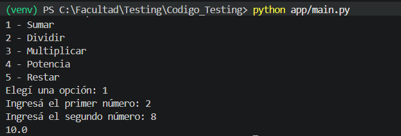
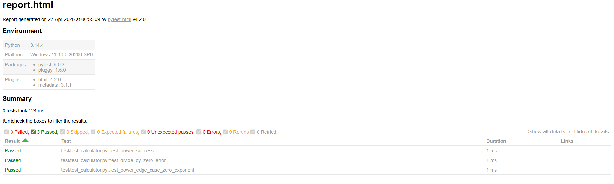
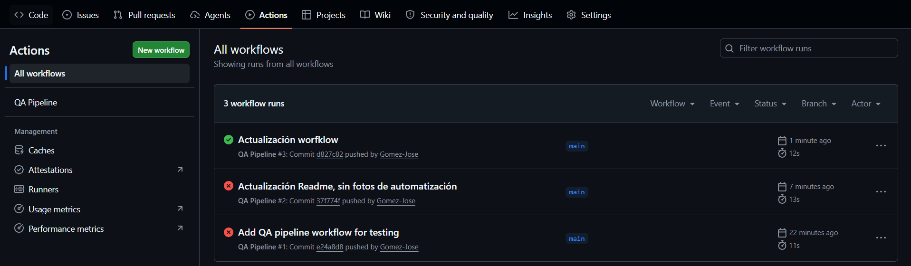
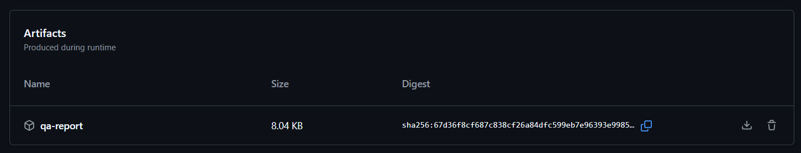

# CI/CD simple para una calculadora

## Descripción

Este proyecto es una calculadora simple implementada en Python que realiza operaciones básicas: suma, resta, multiplicación, división y potenciación. Fue desarrollado como parte del trabajo práctico de la clase de Testing de Aplicaciones.

La calculadora incluye:
- Funciones básicas en `app/calculator.py`
- Interfaz de usuario en `app/main.py`
- Suite de pruebas unitarias en `test/test_calculator.py`
- Reporte HTML de pruebas generado con pytest-html

## Instalación

1. Clona el repositorio:
   ```bash
   git clone https://github.com/Gomez-Jose/Testing-Aut.git
   cd Testing-Aut
   ```

2. Crea un entorno virtual:
   ```bash
   python -m venv venv
   ```

3. Activa el entorno:
   - Windows: `venv\Scripts\activate`
   - Linux/Mac: `source venv/bin/activate`

4. Instala las dependencias:
   ```bash
   pip install -r requirements.txt
   ```

## Uso

Ejecuta la calculadora interactiva:
```bash
python app/main.py
```

Selecciona una operación (1-5) e ingresa dos números.

## Tests

Ejecuta las pruebas:
```bash
python -m pytest
```

Genera reporte HTML:
```bash
python -m pytest --html=report.html --self-contained-html
```

Abrí `report.html` en un navegador para ver los resultados detallados.

## Estructura del Proyecto

```
Testing-Aut/
├── app/
│   ├── __init__.py
│   ├── calculator.py    # Funciones de la calculadora
│   └── main.py          # Interfaz de usuario
├── test/
│   └── test_calculator.py  # Pruebas unitarias
├── .github/
│   └── workflows/
│       └── ci.yml       # Workflow de GitHub Actions
├── requirements.txt     # Dependencias
├── .gitignore           # Archivos ignorados
├── README.md            # Este archivo
└── report.html          # Reporte de pruebas (generado)
```

## Casos de Prueba

- **Caso exitoso**: Operaciones normales (ej. `add(2, 8) == 10`)
- **Caso de error**: Excepciones (ej. división por cero)
- **Caso borde**: Límites (ej. `power(2, 0) == 1`)

## Imágenes

### Interfaz de Usuario


### Reporte de Pruebas


## Automatización

1. Luego al realizar un push, por ejemplo, se dispara automáticamente el test. Para verificarlo ir a:



2. Por último, verificar el artefacto generado:




## Licencia

Este proyecto es para fines educativos desarrollado para la materia testing de applicaciones.